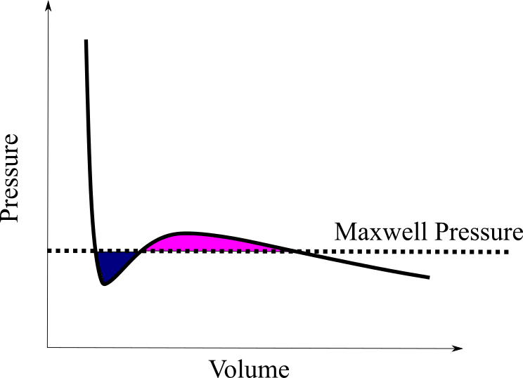
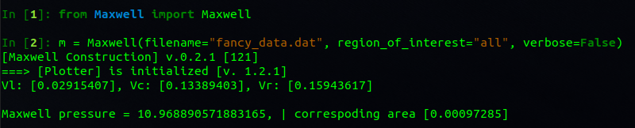
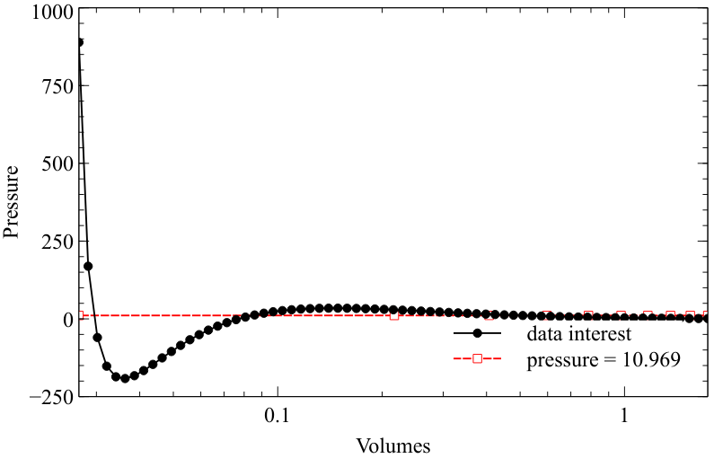
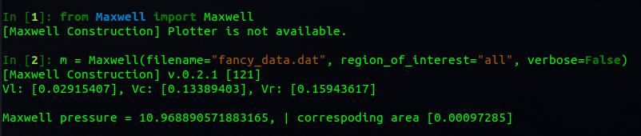

# 1. Maxwell construction

- [1. Maxwell construction](#1-maxwell-construction)
  - [1.1. Usage](#11-usage)
  - [1.2. Contribution](#12-contribution)
  - [Future](#future)

A small script for creating Maxwell construction on your data with non-monotonic behaviour like on figure ([see](pic/idea.png)).
Created for internal needs. Feel free to use it and contribute (see [contribution section](#12-contribution)).

## 1.1. Usage

Easy to use.

1. Create an Maxwell instance: `m = Maxwell(filename=<filename>, region_of_interest="'all'/<your:region>", number_of_points=100, verbose=False)` 
2. It will do the job.

Ex:

The Maxwell construction will work without [Plotter](https://github.com/AlexanderDKazakov/Plotter) instance.

But you cannot see nice animation of the process ;)

## 1.2. Contribution

Feel free to contribute to the project, but please create initially an issue with detailed problem and way to resolve it. 

## Future 

 - improve steps
 - ...

